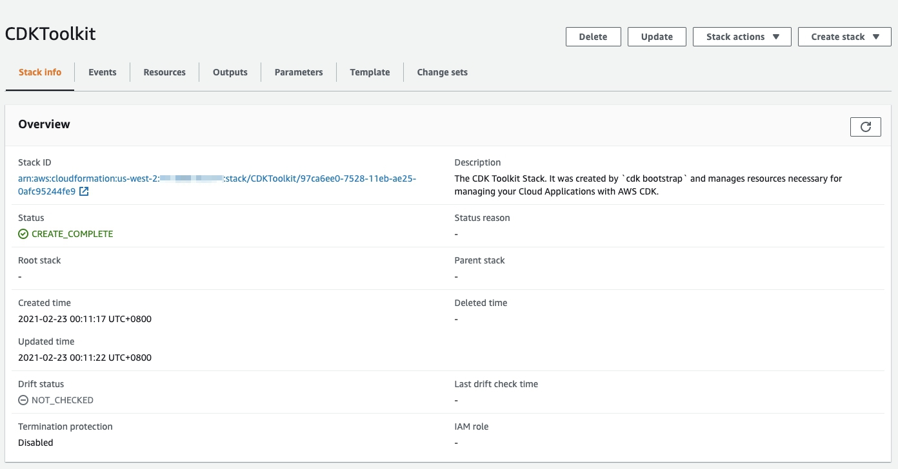

# cdk-working-day-checker 明天要不要上班

這是一個透過 AWS API Gateway, Lambda 組成 API 並透過 CDK 去做部署的範例

從[政府資料開放平臺](https://data.gov.tw/)查獲資料集[中華民國政府行政機關辦公日曆表](https://data.gov.tw/dataset/14718)，加以將搜尋結果作為 API Response

回覆 ***明天*** 為人事行政局發布的工作日 Working Day，抑或是可以放爛耍廢的喪屍日 Walking Dead

## Deploy

透過 `cdk deploy` 做部署，若在部署的 AWS Account 或是 Region中沒有配置過 [CDK Toolkit](https://docs.aws.amazon.com/zh_tw/cdk/latest/guide/cli.html)，會報錯提示需要執行 `cdk bootstrap aws://012345678901/us-west-2`

CDK Toolkit 為幫助 CDK 以 CloudFormation 部署相關資源的工具，會視 CDK 專案內容決定需不需要部署

```bash
$ cdk deploy # need to boostrap first
❌  workingdaychecker-stack-dev failed: Error: This stack uses assets, so the toolkit stack must be deployed to the environment (Run "cdk bootstrap aws://012345678901/us-west-2")
...
...
This stack uses assets, so the toolkit stack must be deployed to the environment (Run "cdk bootstrap aws://012345678901/us-west-2")

$ cdk bootstrap aws://012345678901/us-west-2 # boostrap CDK toolkit
...
...
 ⏳  Bootstrapping environment aws://012345678901/us-west-2...
CDKToolkit: creating CloudFormation changeset...
[██████████████████████████████████████████████████████████] (3/3)

 ✅  Environment aws://012345678901/us-west-2 bootstrapped.
```

可以透過 [CloudFormation Console](https://console.aws.amazon.com/cloudformation/) 確認 CDK Toolkit 的部署狀況



再用 `cdk deploy` 做部署，等待 Stack 建置完畢後，會 Output 出 API Endpoint，再利用 [curl](https://curl.se/) 取得 API Response

```bash
$ cdk deploy
...
Do you wish to deploy these changes (y/n)? y
...
cdk-working-day-checker: deploying...
...
cdk-working-day-checker: creating CloudFormation changeset...
[██████████████████████████████████████████████████████████] (9/9)

 ✅  cdk-working-day-checker

Outputs:
cdk-working-day-checker.apiendpoint = https://un5x4cgo2d.execute-api.us-west-2.amazonaws.com

Stack ARN:
arn:aws:cloudformation:us-west-2:012345678901:stack/cdk-working-day-checker/841a3420-752d-11eb-ae25-0afc95244fe9

$ curl https://un5x4cgo2d.execute-api.us-west-2.amazonaws.com
{"result": "\u660e\u5929\u8981\u4e0a\u73ed\u54e6\uff5e", "workingDay": true, "datetime": "2021-03-04T10:05:00.166838+08:00"}
```

如果不用了，在記得透過 `cdk destory` 刪除 CloudFormation Stack

```bash
$ cdk destory
...
Are you sure you want to delete: cdk-working-day-checker (y/n)? y
cdk-working-day-checker: destroying...
...
7:19:27 PM | DELETE_IN_PROGRESS   | AWS::CloudFormation::Stack     | cdk-working-day-checker

 ✅  cdk-working-day-checker: destroyed
```
